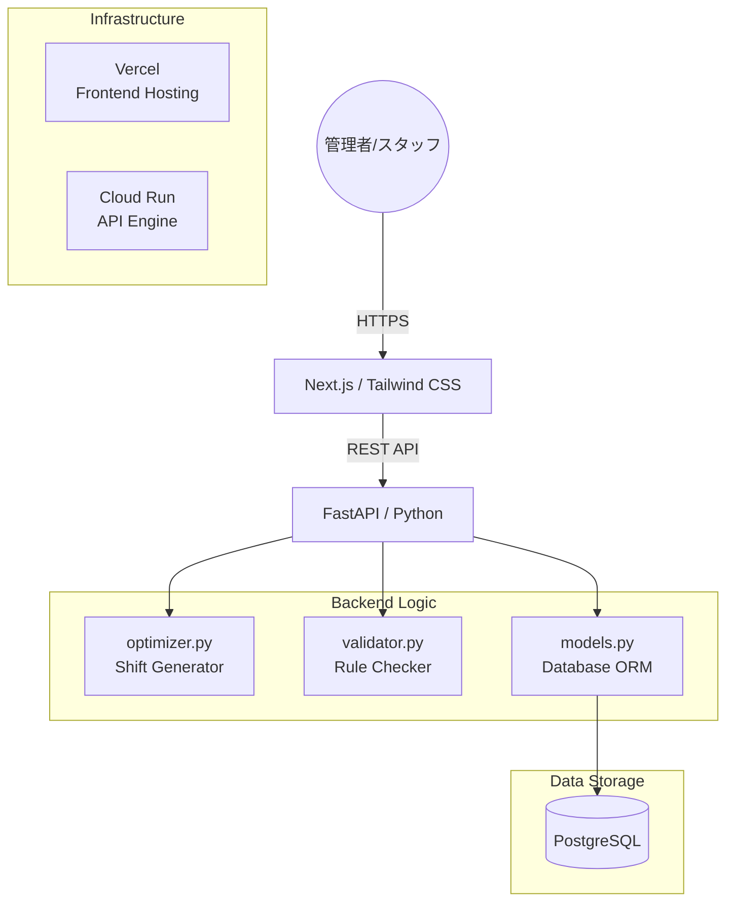

# Clinic Shift Manager for Front Desk 詳細設計書 (Technical Design Document)

## 1. ドキュメント管理
| 項目 | 内容 |
| :--- | :--- |
| **ドキュメント名** | Clinic Shift Manager for Front Desk 詳細設計書 |
| **バージョン** | v1.0.0 |
| **作成日** | 2026-04-29 |
| **更新者** | アプリ開発担当 |
| **状態** | Final (MVP Scope) |

---

## 2. 概要
本システムは、小規模クリニックの**事務スタッフ**に特化したシフト作成・管理システムである。クリニック特有の「午前・午後・夜間」の3部制シフトに対し、スタッフの習熟度（ベテラン/新人）や休み希望を考慮した自動生成ロジックを実装する。Reactを用いた直感的なカレンダー操作と、Pythonによる制約最適化演算を組み合わせ、人員配置の最適化と作成工数の削減を実現する。

---

## 3. システム構成


## 4. 技術スタック
* **プログラミング言語**: TypeScript (Frontend), Python 3.10+ (Backend)
* **フレームワーク**: Next.js, FastAPI
* **最適化ライブラリ**: Google OR-Tools (CP-SAT Solver)
* **データベース**: PostgreSQL
* **インフラ**: Vercel, Google Cloud Run (or AWS App Runner)

## 5. 詳細設計

### 5.1 ディレクトリ構成とファイル一覧
| ファイル名 | 役割と依存関係 |
| :--- | :--- |
| `api/main.py` | 【エントリーポイント】FastAPIの起動、ルート定義、CORS設定。 |
| `api/optimizer.py` | 【最適化ロジック】制約充足問題（CSP）としてシフトをモデル化し、OR-Toolsで計算を実行。 |
| `api/models.py` | 【データモデル】SQLAlchemyを用いたスタッフ、シフト、枠、休み希望のスキーマ定義。 |
| `api/validator.py` | 【バリデーション】手動編集時の制約違反（欠員、新人配置のみ等）をチェック。 |
| `web/components/ShiftCalendar.tsx` | 【UI制御】Reactによるカレンダー描画と、セル内のスタッフ編集ロジック。 |
| `web/hooks/useShifts.ts` | 【API連携】フロントエンドからのシフト取得・更新・生成リクエストの管理。 |

### 5.2 定数・データ構造定義
```python
# 勤務枠の定義
SLOTS = {
    "AM": {"label": "午前診", "id": 1},
    "PM": {"label": "午後診", "id": 2},
    "NIGHT": {"label": "夜間診", "id": 3}
}

# スタッフ属性の定義
class StaffMember:
    id: str
    name: str
    rank: "VETERAN" | "JUNIOR"
    can_recept: bool  # レセコン操作スキルの有無
    max_work_days_per_week: int
```

### 5.3 クラス・メソッド定義とロジック詳細

#### 1) ShiftOptimizer クラス (optimizer.py)
* **変数定義**: `x[d, s, p]` （d日目のs枠にpスタッフを割り当てるか否かのバイナリ変数）。
* **必須制約 (Hard Constraints)**:
    * 各枠の割り当て人数 $N$ は、設定された `min_staff` を満たすこと。
    * 各枠には最低1名の `rank == 'VETERAN'` を含むこと。
    * スタッフの `off_requests`（休み希望）と重複しないこと。
* **ソフト制約 (Soft Constraints)**:
    * 全スタッフの総勤務コマ数の差を最小化し、公平性を保つ。
    * 「夜間診」の翌日の「午前診」への割り当てを避ける（ペナルティ設定）。

#### 2) ShiftValidator ロジック (validator.py)
* **検証メソッド**: 手動変更されたシフト配列を受け取り、以下の警告を返す。
    * `INSUFFICIENT_STAFF`: 人数不足。
    * `NO_VETERAN_WARNING`: ベテラン不在。
    * `DOUBLE_BOOKING`: 同一スタッフの重複配置。

#### 3) ShiftCalendar コンポーネント (web/components/)
* **描画ロジック**: 縦軸に日付、横軸に `SLOTS` を配置したグリッド。
* **編集ロジック**: セルをクリックした際に、出勤可能なスタッフ候補をドロップダウン表示。変更時は即座に Validator を呼び出し、エラーがあればセルを赤くハイライトする。

### 5.4 ワークフロー詳細
1. **希望収集**: スタッフがモバイルUIから `off_requests` を登録。
2. **自動生成**: 管理者が「自動生成」ボタンを実行。バックエンドが数理最適化を行い、一時的なシフト案（Draft）を生成。
3. **調整・確定**: 管理者がUI上で微調整を行い、「確定」ボタンで全スタッフに公開。

## 6. インフラ・運用仕様（非機能要件）

### 6.1 認証・セキュリティ
* **Role-Based Access Control (RBAC)**: `admin` は全機能、`staff` は自身の休み希望入力と確定シフトの閲覧のみ。
* **データ保護**: ログインセッションの管理およびHTTPSによる通信の暗号化。

### 6.2 デプロイフロー
* **CI/CD**: GitHub `main` ブランチへのプッシュにより、GitHub Actionsがトリガー。
* **Frontend**: Vercelへ自動デプロイ。
* **Backend**: Dockerイメージをビルドし、Cloud Runへデプロイ。